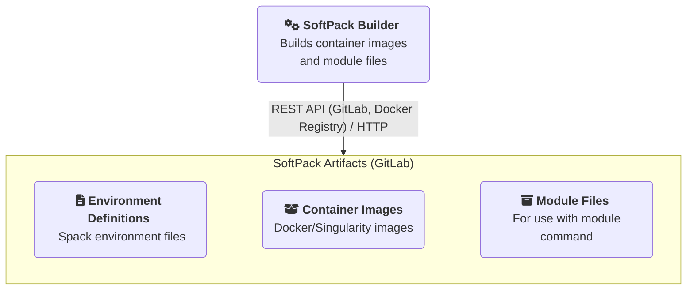

!!! info
    This documentation is under development and may be incomplete.

SoftPack Builder is a lightweight service that listens to WebHooks from
[SoftPack Artifacts][] repository and proceeds to build a container image from a
given environment spec.

## Glossary

!!! note "TODO"
    Add glossary

## Execution environment

SoftPack Builder uses [Prefect][] to execute the build flows. The build flow is
responsible for taking the input spec (received through a webhook or the
command line) and converting it to a container image that can be deployed to
the target system. The build flow carries out the following tasks:

- Create a spack environment file from input spec
- Start spack build
- Create module file
- Push to artifacts repo
    - spack environment file
    - spack lock file
    - container image
    - module file

!!! note "TODO"
    Add flow diagram

All tasks within the build flow are defined as asynchronous tasks to allow
scalability by running the tasks in a distributed environment. Within a flow
itself, sequential dependencies between tasks are handled by passing a
[PrefectFuture][] from one task as input to the next.

### Clutser setup

!!! note "TODO"
    TODO: Add cluster setup

[Prefect]: https://docs.prefect.io
[PrefectFuture]: https://docs.prefect.io/api-ref/prefect/futures/#prefect.futures.PrefectFuture

[SoftPack Artifacts]: https://gitlab.internal.sanger.ac.uk/aa27/softpack-artifacts.git
